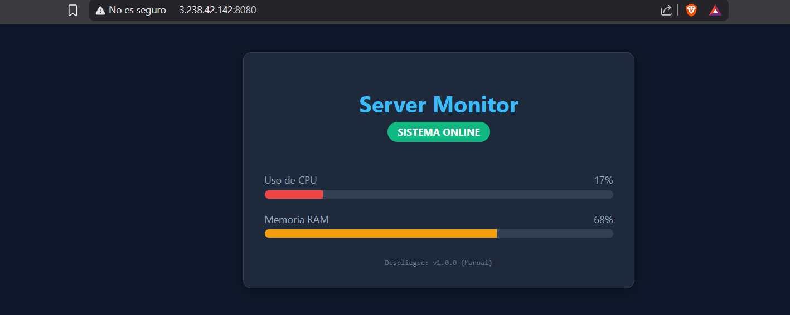

# Pipeline CI/CD Automatizado para Aplicaciones Containerizadas

Proyecto personal diseñado como un laboratorio de ingeniería DevOps para implementar un ciclo de vida de desarrollo moderno, seguro y altamente eficiente utilizando prácticas de **Infraestructura como Código (IaC)**, **Contenerización** e **Integración/Despliegue Continuo (CI/CD)**.

## 🏗️ Arquitectura del Sistema

El flujo de trabajo automatizado se compone de las siguientes tecnologías y etapas:

1. **Código & Control de Versiones:** Aplicación web interactiva basada en **Node.js (Express)** alojada en GitHub.
2. **Contenerización:** Empaquetado de la aplicación mediante **Docker**, aislando el entorno de ejecución sobre una imagen optimizada basada en Alpine.
3. **Infraestructura como Código (IaC):** Aprovisionamiento automatizado en **AWS** (Instancia EC2, Security Groups) utilizando **Terraform**.
4. **Registro de Contenedores:** Gestión y almacenamiento de imágenes Docker en un registro privado de **AWS ECR**.
5. **Pipeline CI/CD:** Automatización completa mediante **GitHub Actions** que compila, testea, sube y despliega la aplicación de forma efímera y segura con cada `git push`.

---

## 🛠️ Tecnologías Utilizadas

- **Cloud Provider:** AWS (EC2, ECR, VPC, IAM)
- **IaC:** Terraform
- **CI/CD:** GitHub Actions
- **Contenedores:** Docker / Docker Desktop
- **Backend:** Node.js (Express)
- **OS Target:** Ubuntu Server Linux

---

## 🚀 Flujo de Trabajo del Pipeline (CI/CD)

El pipeline configurado en `.github/workflows/deploy.yml` realiza las siguientes acciones con cada cambio en la rama `main`:

- **Checkout Code:** Descarga el código fuente en el runner de GitHub.
- **AWS Auth:** Se autentica de forma segura utilizando las llaves de acceso configuradas en los _GitHub Secrets_.
- **Docker Build & Push:** Construye la imagen Docker localmente, la etiqueta y la sube al repositorio de **AWS ECR**.
- **Deploy via SSH:** Se conecta de forma segura a la instancia **EC2**, autentica el servicio de Docker local contra ECR, detiene el contenedor antiguo, descarga la nueva versión (_pull_) y la despliega sin intervención manual.

---

## 🔧 Cómo Ejecutar este Laboratorio (Enfoque Efímero)

Este proyecto fue diseñado bajo el principio de **infraestructura efímera**. Se puede desplegar para pruebas y destruir por completo en minutos para optimizar costos de infraestructura.

### Prerrequisitos

- AWS CLI configurado con credenciales con acceso a EC2 y ECR.
- Terraform instalado localmente.
- Una llave SSH (`llave-laboratorio.pem`) generada en la región de AWS seleccionada.

### Paso 1: Clonar el repositorio

```bash
git clone https://github.com/YampierPonceV/proyecto-pipelines.git
cd TU_REPOSITORIO
```

---

## Proyecto desplegado


